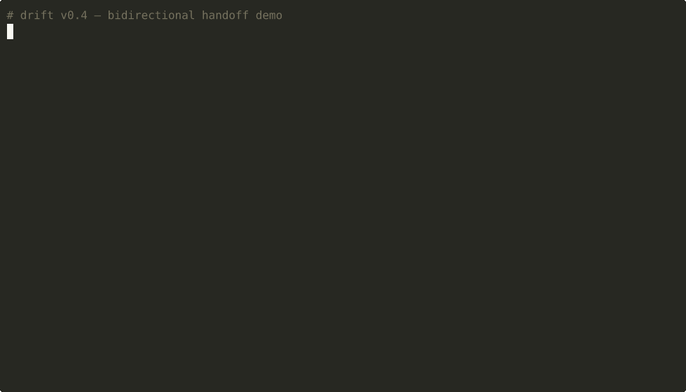

> 🌐 [English](README.md) · [日本語](README.ja.md) · **简体中文** · [繁體中文](README.zh-Hant.md)

# drift_ai

[](https://crates.io/crates/drift-ai)
[](https://github.com/ShellFans-Kirin/drift_ai/actions/workflows/ci.yml)

> AI coding 任务的厂商中立 handoff — 在 Claude、GPT、Gemini、DeepSeek、本地 LLM 之间。
> 读取 Claude Code、Codex、Cursor、Aider 的 session。Local-first。



---

## 🧠 切换 AI agent 时,开发就会断裂

Claude 卡住、Codex 拒答、Cursor 失控。

你被迫花 **30 分钟重新解释已经做过的事情**。

- 已经做了哪些决策？
- 哪些方法试过但失败？
- 刚刚改到哪个文件？

👉 这些全部都会消失。

---

## ❌ Git 只能记录代码，记录不了 AI 推理

Git 告诉你「改了什么」，
但不会告诉你：

- 为什么这样写
- 哪些方案被否决
- 哪个 agent 做的
- 当时的上下文是什么

这些推理过程会直接消失。

---

## ✅ Drift 解决这个问题

> Drift = AI 决策的 git blame

---

## ⚡ Before / After

### Before

- 复制粘贴聊天记录
- 重新解释全部
- 决策遗失
- AI 重复犯错

### After

- 结构化 markdown brief
- 保留决策与失败路径
- 可直接接手
- 不用重新解释

---

**问题**：你的 AI coding agent 卡住了 — 拒答、被 rate limit、或者突然变笨。
现在你得把 30 分钟累积的上下文转给另一个 agent。直接把对话历史贴过去没用；新
agent 不知道哪些决策已经定了、哪些做法你试过然后放弃了、或上一刻你写到哪个
文件的哪一行。

**`drift handoff`** 把进行中的任务打包成任何 LLM 都能冷读的 markdown brief：

```bash
$ drift handoff --branch feature/oauth --to claude-code
⚡ scanning .prompts/events.db
⚡ extracting file snippets and rejected approaches
⚡ compacting brief via claude-opus-4-7
✅ written to .prompts/handoffs/2026-04-25-1530-feature-oauth-to-claude-code.md
```

Brief 会列出已经决定的事、试过但被驳回的做法、还没解决的点、以及下一步从哪
里接。贴到下一个 agent，他们就能不需要你重新解释直接接手。

`drift` 建在 v0.1 的 attribution engine 之上 — 那一层在背景监看你 AI coding
agent（Claude Code、Codex、Aider…）的本地 session log，逐 session 用 LLM
compact，把结果存进 git repo 内的 `.prompts/`，并通过 `git notes` 把每个
session 绑定到对应的 commit。Handoff 是 v0.2 新增的 wedge feature；attribution
engine 仍由 `drift blame` / `drift log` 这一侧支撑。

装完之后，`drift log` 仍然会显示每个 commit 的多 agent attribution：

```
commit abc1234 — Add OAuth login
   💭 [claude-code] 7 events accepted, 0 rejected
   💭 [codex]       3 events accepted, 1 rejected
   ✋ [human]       2 manual edits
```

…而 `drift blame` 仍然能把任意一行 code 还原成完整的 timeline。
项目 thesis 见 [`docs/VISION.md`](docs/VISION.md)。

## 为什么需要 drift

AI coding 已经不是单一 agent 的工作流了。今天一段真实的开发 session 比较像这样:

- 你在 Claude Code 上开了个 feature，写到一半遇到 rate limit、或 context
  window 塞满，或者你发现 LLM 突然 **变蠢** 了，被迫中途放弃。
- 你切到 Codex（或 Aider、或别的 model），但新 agent 不知道你试过哪些做法、
  哪些决策已经定了、哪些是 *刻意* 被驳回的。
- 你把 chat 贴过去给新 agent。信息嘈杂、agent 把已经定案的问题又拉出来讨论，
  你花十分钟重新解释想做的事，而不是继续往前走。
- 一周后 review commit，你分不出哪几行是哪个 agent 写的、哪些是人类在 AI
  建议上加的编辑、code 为什么最后长这样。
- 同事 clone repo 看到的是 code，但产生这份 code 的推理过程不见了 — 那段
  历史活在某个人的 Claude / Codex chat 里、在某个人的笔记本上，现在实质已经消失。

`drift` 把这条本来会丢掉的 AI 轨迹转成可长期保存的 project memory：

- **本机 capture**：`drift capture`（以及 `drift watch` 走 live mode）读你
  agent 本来就会写到 `~/.claude/projects/` 跟 `~/.codex/sessions/` 的 session
  JSONL。除了你可以关掉的可选 Anthropic compaction 之外，没有任何数据离开你
  的机器。
- **压成 markdown**：每段 session 变成 `.prompts/sessions/` 下一份小的 markdown
  摘要 — 留下的决策、被驳回的做法、改过的文件。读起来轻、grep 起来轻、跨 vendor
  迁移也不会丢，因为这就只是 repo 里的 text。
- **绑到 commit**：`drift bind` / `drift auto-bind` 通过 `git notes`
  （`refs/notes/drift`）把每段 session 绑到它产出的 commit。链接跟着 repo 走，
  不污染 commit history。
- **切 agent 时 handoff**：`drift handoff --branch <b> --to <agent>` 产一份
  下一个 agent 能冷读的 brief — 哪些做完、哪些还开着、哪些已经被驳回、从哪
  里接。
- **忘记时反查**：`drift blame <file> [--line N]` 返回那一行 code 背后的完整
  timeline：哪个 session、哪个 prompt、哪个 agent，加上后续落上去的人类编辑。
- **记得 session 不记得 diff 时顺查**：`drift trace <session-id>` 列出该 session
  产生的每条 `CodeEvent`。
- **跨 release 做 audit**：`drift log` 是 `git log` 但每个 commit 下面多一段
  per-agent 摘要 — 要回答「这次 release 多少是 AI、多少是人类」而不靠 LOC
  比例瞎猜时很有用。

最终效果：multi-agent AI coding 变成可以 handoff、review、几个月后还原得回来的
东西 — 而不是下次关掉 tab 就消失的 chat history。

## 安装

**Homebrew**（macOS arm64/x86_64、Linux arm64/x86_64）：

```bash
brew install ShellFans-Kirin/drift/drift
```

**crates.io**（需要 Rust 1.85+ toolchain）：

```bash
cargo install drift-ai
```

**预编译二进制**（GitHub Releases）：

```bash
curl -sSfL https://github.com/ShellFans-Kirin/drift_ai/releases/latest/download/drift-v0.4.2-$(uname -m)-unknown-linux-gnu.tar.gz \
  | tar xz -C /tmp && sudo mv /tmp/drift /usr/local/bin/drift
drift --version
```

**从源码**：

```bash
git clone https://github.com/ShellFans-Kirin/drift_ai.git
cd drift_ai
cargo install --path crates/drift-cli
```

## 隐私与 secrets

`drift` **不会**主动清洗 session 内容。你打进 Claude Code / Codex session 的任何
文字 — 包括手滑贴进去的 secret — 都会被镜像到 `.prompts/`，默认情况下也会被
commit 进 repo。

目前提供两个调节旋钮：

1. 在 `.prompts/config.toml` 设置 `[attribution].db_in_git = false`，让 `events.db`
   只留在本机。
2. 在 `git add` 之前先 review 一遍 `.prompts/sessions/`。

默认 `db_in_git = true`（整个 team 通过 repo 共享 blame）。个人 repo 或
敏感内容时，切到 `false` — 见 [Configuration](#configuration)。

未来某个版本会新增一轮 regex-based redaction。要当下就完整覆盖的话，把
`drift` 跟 [gitleaks](https://github.com/gitleaks/gitleaks) 或
[trufflehog](https://github.com/trufflesecurity/trufflehog) 配成 pre-commit
hook 一起跑。

> **如果你常把 secret 贴进 AI session，请等 redaction pass 上线再到共享
> repo 上启用 `drift`。**

第一次跑 `drift capture` 会显示一次性 notice 重述上述内容；按 Enter 确认即可。
在 CI 中用 `DRIFT_SKIP_FIRST_RUN=1` 跳过。

完整的 threat model 与 roadmap 见 [`docs/SECURITY.md`](docs/SECURITY.md)。

## 快速上手

六个命令、零 config：

```bash
cd your-git-repo
drift init                                          # scaffold .prompts/
drift capture                                       # pull sessions from ~/.claude + ~/.codex
drift handoff --branch feature/oauth --to claude   # task transfer (v0.2 起)
drift blame src/foo.rs                              # 反查：谁写了这行
drift trace <session-id>                            # 顺查：session → events
drift install-hook                                  # 每次 commit 后自动跑
```

`drift handoff` 是 v0.2 的招牌功能：把进行中的任务打包成下一个 agent 能冷读的
brief。完整流程见 [§Handoff](#handoff--跨-agent-task-transfer-v02)。

从 `/tmp` 零状态验证过：

```bash
rm -rf /tmp/drift-smoke && mkdir -p /tmp/drift-smoke && cd /tmp/drift-smoke
git init -q && git config user.email "x@y" && git config user.name x
drift init && drift capture && drift list
```

## Handoff — 跨 agent task transfer (v0.2)

`drift handoff` 从你本机的 `events.db`（由 `drift capture` 或 `drift watch` 累积
而来）读数据，按你指定的 scope 筛选 sessions，产出一份 handoff 用的 markdown
brief，结构如下：

- **What I'm working on** — 3-5 句意图（LLM compacted）。
- **Progress so far** — done / in-progress / not-started 列表。
- **Files in scope** — 改过的范围 ±5 行 context。
- **Key decisions** — 附 session+turn 引用。
- **Rejected approaches** — 从 session 的 tool error 预先抽出。
- **Open questions / blockers**。
- **Next steps**。
- **How to continue** — 直接贴进下一个 agent 的 prompt。

```bash
# 用 git branch 圈定 scope（推荐）：所有最终落在这个 branch（从 main 分出之后）
# commit 对应的 session
drift handoff --branch feature/oauth --to claude-code

# 用时间 scope
drift handoff --since 2026-04-25T08:00:00Z --to codex

# 单个 session（debug 用）
drift handoff --session abc12345-xxx --print

# pipe 到 clipboard 或其他工具
drift handoff --branch feature/oauth --print | pbcopy
```

默认 model 是 `claude-opus-4-7` — brief 是下一个 agent 逐字读的内容，叙事质量
比 v0.1 的 per-session compaction 更重要。每次 handoff 在 Opus 价位下大约
≈ \$0.10–0.30 USD。要牺牲叙事换 ~30× 成本下降，在 `.prompts/config.toml` 切到
Haiku：

```toml
[handoff]
model = "claude-haiku-4-5"   # 默认是 "claude-opus-4-7"
```

## Live mode — 事件驱动 watcher

`drift watch` 是事件驱动的 daemon，底层用各 platform 原生的 file-system
notification（macOS FSEvents、Linux inotify、Windows ReadDirectoryChangesW）。
对同一个 session 文件的密集写入会在 200ms 窗口内合并，所以一个跑很久的 Claude
Code 或 Codex session 每段 idle 才触发一次 capture，不会每个 tool call 都触发
一次。状态存到 `~/.config/drift/watch-state.toml`，restart 之后 resume 而不是
全重扫。`Ctrl-C` 会等当前 capture 收尾后再干净退出。

```bash
drift watch
# drift watch · event-driven; Ctrl-C to stop
#   watching /home/you/.claude/projects
#   watching /home/you/.codex/sessions
#   first run; capturing every session seen
# drift capture · provider=anthropic
# Captured 10 session(s), wrote 192 event(s) to .prompts/events.db
# ...
# drift watch · interrupt received; exiting after last capture
```

## 成本透明

每一次 Anthropic compaction 调用都会写进 `events.db` 的 `compaction_calls` 表，
带 input / output / cache token 数量与算好的 USD 成本（内置依 model 的计价表；
当作正式发票之前请先核对 <https://www.anthropic.com/pricing>）。

```bash
drift cost
# drift cost — compaction billing
#   total calls      : 10
#   input tokens     : 120958
#   output tokens    : 6582
#   cache creation   : 0
#   cache read       : 0
#   total cost (USD) : $0.1539

drift cost --by model
# ── grouped by model (descending cost)
#   key                    calls   input_tok   output_tok     cost (USD)
#   claude-haiku-4-5          10      120958         6582        $0.1539

drift cost --by session
# ── grouped by session (descending cost)
#   key                                     calls   input_tok   output_tok     cost (USD)
#   4b1e2ba0-621c-4977-af3f-2a9df5ac45ec        2       51696         2448        $0.0564
#   ad01ae46-156f-403b-b263-dd04a232873a        1       33662         2390        $0.0456
#   ...
```

可用 `--since <date>`、`--until <date>`、`--model <name>` 过滤。在同一份 10 session
语料上把 Opus 换成 Haiku，compaction 成本从 **$2.91 → $0.15** — ~19× 下降，代价
是摘要会更精简一点。

## AI-native blame

`drift blame` 是反查：给一行 code，返回改过它的完整 timeline（多 agent + 人类
编辑都算），每条都连到原始的 session 与 prompt。

完整三大场景见 [`docs/VISION.md`](docs/VISION.md)：
**反查**（`drift blame`）、**顺查**（`drift trace`）、**audit**（`drift log`）。

## MCP 集成

Drift AI 内置一个 stdio MCP server（`drift mcp`）。任何 MCP-compatible 的 client
都能调用这 5 个只读 tool — `drift_blame`、`drift_trace`、`drift_rejected`、
`drift_log`、`drift_show_event` — 直接查 attribution，不需要另外开 subshell。

**Claude Code**（一行）：

```bash
claude mcp add drift -- drift mcp
```

**Codex**：

```bash
codex mcp add drift -- drift mcp
```

Tool 设计上是只读的 — 任何会改动 state 的动作（`capture` / `bind` / `sync`）
只在 CLI 提供。

## Commands

| Command | 用途 |
|---------|---------|
| `drift init` | scaffold `.prompts/` + 项目 config |
| `drift capture` | 一次性：发现 session、compact、attribute |
| `drift watch` | 背景 daemon，debounced re-capture |
| `drift handoff [--branch B --to A --print --output P]` | **v0.2** — 跨 agent task brief |
| `drift list [--agent A]` | 列出已 capture 的 session |
| `drift show <id>` | 显示 compacted session |
| `drift blame <file> [--line N] [--range A-B]` | **反查** |
| `drift trace <session-id>` | **顺查** |
| `drift diff <event-id>` | 单个 event 的 unified diff |
| `drift rejected [--since DATE]` | 列出被驳回的 AI 建议 |
| `drift log [-- <git-args>]` | `git log` + 每个 agent 的 session 摘要 |
| `drift bind <commit> <session>` | 把 session 绑定到 commit note |
| `drift auto-bind` | 按 timestamp 自动配对每个 session 跟最近的 commit |
| `drift install-hook` | 安装 non-blocking 的 post-commit hook |
| `drift sync push\|pull <remote>` | push/pull `refs/notes/drift` |
| `drift config get\|set\|list` | 全局 + 项目 TOML 合并读写 |
| `drift mcp` | 启动 stdio MCP server |

## Configuration

全局：`~/.config/drift/config.toml`
项目（覆盖）：`<repo>/.prompts/config.toml`

```toml
[attribution]
db_in_git = true          # default — 整个 team 通过 repo 共享 blame

[connectors]
claude_code = true
codex = true
aider = false             # feature-gated stub

[compaction]
provider = "anthropic"      # default；切 "mock" 完全离线 / 测试
model = "claude-haiku-4-5"  # 或 claude-sonnet-4-6 / claude-opus-4-7

[handoff]
model = "claude-opus-4-7"   # 叙事质量就是价值；要 ~30x 成本下降切
                            # "claude-haiku-4-5"
```

`ANTHROPIC_API_KEY`：走 live API compaction 路径时必填。没设的话 drift_ai 会
透明地 fall back 到 `MockProvider`，每份摘要都会打上 `[MOCK]` 标记，所以你不会
把 fallback run 误当成 real run — pipeline 其他部分都不变。

drift 跟 Cursor / Copilot history、Cody、`git blame` 本身的对比见
[`docs/COMPARISON.md`](docs/COMPARISON.md)。

## 诚实的限制（v0.4.2）

- 人类编辑检测只靠 SHA ladder — 我们不主张「作者是谁」，`human` slug 的意思是
  「没有 AI session 产生这段内容」。详见 VISION.md。
- `Bash python -c "open(...).write(...)"` 是 best-effort；shell lexer 漏掉的会被
  SHA ladder 接住、归到 `human`。
- Codex 的 `reasoning` item 是加密的；我们会计数但不会把内容 surface 出来。
- 成本总额用内置的 hardcoded 计价表 — 当作正式 invoice 之前请核对
  <https://www.anthropic.com/pricing>。
- Context-window 截断目前是确定性的 head+tail 省略（Strategy 1）；分层式摘要
  （Strategy 2）已 stub 在 feature flag 后等 v0.2 开启。

## 关于

`drift` 是 [@ShellFans-Kirin](https://github.com/ShellFans-Kirin)
（[shellfans.dev](https://shellfans.dev)）独立维护的开源项目。**不**隶属于
Anthropic、OpenAI 或任何被 drift 集成的 agent vendor — `drift` 是建在他们的
session log 之上，不是他们做的。

> 这个工具最初是写给自己用的 — 那时候在 Codex 卡住跟 Claude 被 rate-limit 之间
> 不断丢上下文。v0.2 的 `drift handoff` 是我自己每天用得最多的部分。

## License

Apache 2.0 — 见 [LICENSE](LICENSE)。

## Contributing

见 [CONTRIBUTING.md](CONTRIBUTING.md) — 里面用 Aider stub 当例子走完一遍「新增
connector」的流程。
