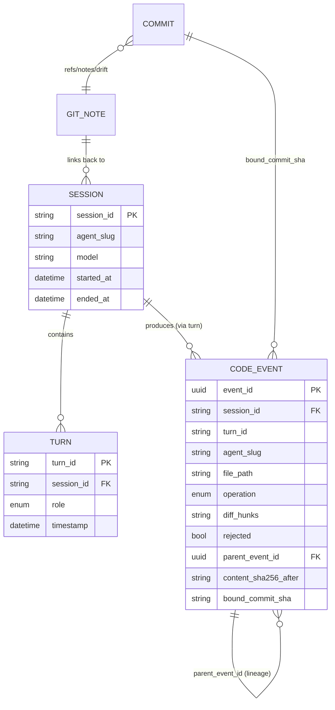

# drift_ai — Phase 0 Proposal (revision 2)

**Status**: Awaiting approval before Phase 1.
**Author**: drift_ai bootstrap automation
**Date**: 2026-04-21
**Supersedes**: rev 1 (which lacked the line-level attribution layer)

drift_ai is a local-first CLI that captures completed AI coding sessions
(Claude Code, Codex, Aider, ...), LLM-compacts them, stores the result in
`.prompts/` inside the user's git repo, **builds a line-level attribution
layer linking every code event back to its originating prompt**, and binds
each session to its matching commit via `git notes`.

**Thesis**: commit granularity is too coarse to be the source of truth in
the AI era. The real source of truth is _"how did each line of code come
to be"_: which AI under which prompt wrote what, how a human later changed
it, and which approaches were suggested but rejected. drift_ai is the AI-
native `git blame` for that timeline.

This v0.1.0 must validate three things on day one:

1. **Cross-agent**: a single connector abstraction serving Claude Code +
   Codex (two materially different formats).
2. **Line-level**: blame resolves to a line, not a commit.
3. **Multi-origin / human-aware / rejection-aware / rename-aware**: the
   data model expresses all four — proven before any code is written.

This proposal is the only checkpoint where bootstrap stops for human review.

---

## A. Host Environment Inventory

| Tool | Version | Status |
|------|---------|--------|
| `git` | 2.43.0 | OK |
| `gh` | 2.45.0 | ✅ authenticated as `shellfans-dev` (PAT supplied 2026-04-21) |
| `node` | 18.19.1 | OK |
| `python3` | 3.12.3 | OK |
| `rustc` / `cargo` | 1.75.0 | Installed in Phase 0 |
| `go` | 1.22.2 | Installed in Phase 0 |
| `claude` | 2.1.117 | OK |
| `codex` | codex-cli 0.122.0 | OK; sandbox blocked by missing bubblewrap permissions on this host (writes through `apply_patch` fail at execution, but the intent is fully captured in the rollout JSONL) |
| `git config` | empty originally | Set to `kirin / kirin@shell.fans` in Phase 0 |
| `ANTHROPIC_API_KEY` | **not set** | **[NEEDS-INPUT]** for Phase 3 real-API smoke; Mock works for tests |
| `gh repo view shellfans-dev/drift_ai` | exists | Created Phase 0 |

**Sessions on disk after Phase 0 seeding** (4 total — bootstrap doesn't
need more, fixtures will be hand-derived from these):

```
~/.claude/projects/-home-kirin/3d132809-...jsonl   pre-existing,  10 lines, plain chat
~/.claude/projects/-home-kirin/80bfcde5-...jsonl   pre-existing,  26 lines, Bash tool_use cycle
~/.claude/projects/-home-kirin/3e3646df-...jsonl   THIS bootstrap conversation; excluded from analysis
~/.claude/projects/-tmp-drift-seed-claude/40c15914-...jsonl   seed: Write + Edit attempts (perms denied; tool_use shape captured)

~/.codex/sessions/2026/04/21/rollout-2026-04-21T05-46-12-...jsonl   pre-existing, 22 lines (exit/exit)
~/.codex/sessions/2026/04/21/rollout-2026-04-21T06-58-59-...jsonl   seed: read-only blocked
~/.codex/sessions/2026/04/21/rollout-2026-04-21T06-59-16-...jsonl   seed: apply_patch + exec_command shape captured (sandbox denied writes)
```

The seeds got blocked at execution (sandbox denied Write/apply_patch), but
the **tool-call envelopes are present in the JSONL**, and that is what the
attribution layer parses. Schema confirmed below.

---

## B. Technical Stack — Three Options

Evaluation dimensions for v0.1.0 (added vs. rev 1: text-diff library,
SQLite ergonomics):

| Dimension | Rust | Go | TypeScript |
|-----------|------|----|-----------|
| Distribution (single binary) | best | best | needs Node, or `pkg`/`nexe` |
| Daemon perf (`drift watch`) | `notify` crate | `fsnotify` | `chokidar` |
| Dev velocity | slowest | medium | fastest |
| Cross-platform binary | mature | mature | awkward |
| Contributor pool for AI tooling | medium | large | largest |
| **Text diff / patch parsing** | `similar`, `diffy`, `patch` | `go-diff` (less rich) | `diff` (jsdiff, fine) |
| **Embedded SQLite** | `rusqlite` (mature, bundled) | `mattn/go-sqlite3` (cgo) | `better-sqlite3` (native compile) |
| Anthropic SDK | community crate | community | first-party |

### Recommendation: **Rust**

_drift_ai's value is being a quietly-running daemon that also publishes a
single binary contributors can drop into CI; combined with diff/patch
parsing being a hot path in the attribution engine, Rust wins on both
distribution and inner-loop performance, and `rusqlite` makes the events.db
story painless. Velocity hit is acceptable for a v0.1.0 with ~10 commands._

If "MVP velocity is the bigger risk" — **Go** is the safe fallback
(same binary story, cgo-sqlite is fine, slightly noisier connector trait).
TypeScript wins only if drift_ai is reframed as "for npm-native users
only"; an AI tool that requires Node to install is acceptable, but it
locks out the polyglot sysadmin/CI-only user.

### Package & binary naming

| Layer | Name | Reason |
|-------|------|--------|
| GitHub repo | `drift_ai` | already created |
| Cargo crate | `drift-ai` | Rust convention is hyphen; auto-maps to module `drift_ai` |
| Go module path | `github.com/shellfans-dev/drift_ai` | matches repo |
| npm package | `drift-ai` | npm convention is hyphen |
| **CLI binary** | `drift` | short, ergonomic; user types `drift blame ...` |
| `git notes` ref | `refs/notes/drift` | tracks the binary name, not the package |
| SQLite app id | `drift_ai` | matches repo |

Cargo.toml will look like:
```toml
[package]
name = "drift-ai"
[[bin]]
name = "drift"
path = "src/main.rs"
```

---

## C. JSONL Schema Analysis (file-op focused)

The attribution layer needs every connector to produce, per tool call, the
five-tuple: `(file_path, op_kind, before_content_or_old, after_content_or_new,
timestamp)`. Below is the evidence that both agents make this extractable.

### C.1 Claude Code (flat lines, `type` discriminator)

Each line carries session-scope metadata (`sessionId`, `cwd`, `gitBranch`,
`version`, `entrypoint`, `userType`) plus a `parentUuid → uuid` thread tree.
Linearise by walking chronologically by `timestamp`.

**File-op tools** (confirmed shapes from `/tmp/drift-seed-claude/...`):

| `name` | `input` shape | How to derive `(before, after)` |
|--------|---------------|----------------------------------|
| `Write` | `{file_path, content}` | Read prior known content from store (or empty if file did not exist); after = `content`. |
| `Edit` | `{file_path, old_string, new_string, replace_all}` | before/after directly given; compute hunk by locating `old_string` in the file. |
| `MultiEdit` | `{file_path, edits: [{old_string, new_string, replace_all}]}` | Apply edits in order against prior content. |
| `NotebookEdit` | `{notebook_path, cell_id, ...}` | Separate path; defer detailed handling, count as edit. |
| `Bash` with `mv X Y` / `git mv X Y` | `{command, description}` | Parse the command for rename intent. |
| `Bash` with `rm X` | as above | Delete intent. |
| `Bash` with `> X` / `>> X` / `tee X` | as above | Write intent (best-effort). |

**Tool result** for any of the above sits in the next user message as
`{tool_use_id, content, is_error}`. `is_error: true` means the operation
**was attempted but rejected** (permissions denied, file not found, etc.) —
this is the primary signal source for "rejected AI suggestion" attribution.

**Reasoning / `thinking` blocks**: encrypted opaque content; we drop the
payload, keep a counter `thinking_block_count` in turn metadata.

### C.2 Codex (uniform envelope `{timestamp, type, payload}`)

Threading by `turn_id` on every meaningful event; turns are already
chronologically ordered.

**File-op tools** (confirmed shapes from `~/.codex/sessions/.../rollout-...06-59-16-...jsonl`):

| `payload.type` | `payload.name` | `payload.input` / `arguments` | How to derive `(before, after)` |
|----------------|----------------|------------------------------|----------------------------------|
| `custom_tool_call` | `apply_patch` | `input` is a **literal patch envelope** (text): `*** Begin Patch / *** Add File / *** Update File / *** Delete File / *** Move File ... *** End Patch` | Parse the patch envelope — it self-describes op kind, paths, and `+`/`-` lines. |
| `function_call` | `exec_command` | `arguments` = JSON `{cmd, workdir, ...}` | Parse `cmd` for `mv`, `cp`, `rm`, redirections, `sed -i`, `awk -i inplace`, etc. Best-effort signal source. |
| `function_call_output` | (matched by `call_id`) | `output` text | Determines success vs. failure for the matched call. |

**Confirmed envelope** of `apply_patch` from the seed session:
```
*** Begin Patch
*** Add File: ./hi.txt
+hello
+drift
*** End Patch
```

For `Update File`, the envelope adds `@@` context blocks plus `-`/`+`
lines — directly mappable to unified-diff hunks without re-running diff.

**Reasoning items** (`type: "reasoning"`): encrypted blob (`encrypted_content`).
Same treatment as Claude — drop payload, keep count.

### C.3 The 5 differences the connector trait must hide

1. Envelope vs. flat (Codex unwraps `payload`; Claude does not).
2. Tree-by-`parentUuid` vs. linear-by-`turn_id` threading.
3. `tool_use` inline in assistant content (Claude) vs. separate
   `response_item` per tool call (Codex).
4. Where session ID lives (Claude: every line; Codex: only `session_meta`).
5. **File-op representation**: Claude gives semantic ops (`Write`/`Edit`)
   you must diff yourself; Codex gives a patch envelope you must parse but
   that is already diff-shaped.

The `extract_code_events()` method on the connector trait normalises both
into the same `CodeEvent` (defined in §D.2). No string-hacking required.

---

## D. Data Model Design (the rev-2 addition)

This section is the proposal's gating concern: if the data model can't
honestly express the four requirements, we re-design before writing code.

### D.1 NormalizedSession (session layer)

```
NormalizedSession {
  session_id        : String         // "80bfcde5-3658-4449-ae7b-334acd49762b"
  agent_slug        : String         // "claude-code" | "codex" | "aider"
  model             : Option<String> // "claude-opus-4-7", "gpt-5.4", null if unknown
  working_dir       : PathBuf        // "/home/kirin/drift_ai"
  git_head_at_start : Option<Sha>    // git HEAD when first turn fired
  started_at        : DateTime<Utc>  // 2026-04-21T05:48:31Z
  ended_at          : DateTime<Utc>  // 2026-04-21T05:53:01Z
  turns             : Vec<Turn>      // ordered, linearised
  thinking_blocks   : u32            // metadata only; payloads dropped
}

Turn {
  turn_id           : String         // stable id; for Claude = leaf uuid of the turn,
                                     //            for Codex = payload.turn_id
  role              : Role           // User | Assistant | ToolResult
  content_text      : String         // flattened text view, for compactor
  tool_calls        : Vec<ToolCall>  // empty unless assistant turn with tools
  tool_results      : Vec<ToolResult>// empty unless this is a tool-result turn
  timestamp         : DateTime<Utc>
}
```

### D.2 CodeEvent (line layer — the new core record)

One row per file mutation attempt observed in any session, OR per detected
human change. This is the table behind `drift blame` and `drift trace`.

```
CodeEvent {
  event_id            : Uuid              // primary key
  session_id          : Option<String>    // null when agent_slug = "human"
  agent_slug          : String            // "claude-code" | "codex" | "aider" | "human"
  turn_id             : Option<String>    // points back into NormalizedSession.turns,
                                          //   so blame can fetch the originating prompt
  timestamp           : DateTime<Utc>
  file_path           : String            // relative to repo root
  operation           : Operation         // Create | Edit | Delete | Rename
  rename_from         : Option<String>    // populated iff operation = Rename
  line_ranges_before  : Vec<(u32,u32)>    // [[start_line, end_line], ...]; empty for Create
  line_ranges_after   : Vec<(u32,u32)>    // [[start_line, end_line], ...]; empty for Delete
  diff_hunks          : String            // unified diff (RFC 2 format), the canonical record
  rejected            : bool              // true iff matching tool_result was is_error
                                          //   OR a subsequent tool_use undid this op without
                                          //   acceptance
  parent_event_id     : Option<Uuid>      // points to the previous event that this one
                                          //   modifies (lineage chain); null for first event
                                          //   on a path
  content_sha256_after: Option<Sha256>    // file SHA-256 immediately after this event
                                          //   succeeded; null when rejected = true
  bound_commit_sha    : Option<Sha>       // git commit this event ended up in (filled by
                                          //   auto-bind / post-commit hook)
}

Operation enum: Create | Edit | Delete | Rename
```

**Storage**: `.prompts/events.db`, single SQLite file. One table
`code_events` plus indexes:

```sql
CREATE INDEX idx_events_file_ts    ON code_events(file_path, timestamp);
CREATE INDEX idx_events_session    ON code_events(session_id);
CREATE INDEX idx_events_commit     ON code_events(bound_commit_sha);
CREATE INDEX idx_events_rejected   ON code_events(rejected) WHERE rejected = 1;
CREATE INDEX idx_events_parent     ON code_events(parent_event_id);
```

### D.3 Human-edit detection (SHA-256 ladder)

```
For each AI CodeEvent E with rejected = false:
    record E.content_sha256_after = SHA256(file at E.file_path immediately after apply)

At any of {drift watch tick, drift capture, post-commit hook fire}:
    For each file_path with a known last_known_sha (= most recent
                                                    E.content_sha256_after):
        current_sha = SHA256(read(file_path))
        if current_sha != last_known_sha:
            emit CodeEvent {
                agent_slug         = "human",
                session_id         = null,
                turn_id            = null,
                operation          = Edit,
                diff_hunks         = unified_diff(<file at last_known_sha>, current),
                content_sha256_after = current_sha,
                parent_event_id    = E.event_id,
                ...
            }
```

Note we do **not** try to attribute the human edit to a specific person —
attribution is *event timeline*, not authorship judgement. The `human` slug
just means "no AI session produced this".

To diff against the prior state without keeping all old file contents,
drift_ai stores a small content-addressed cache at `.prompts/cache/blob/<sha>`
with LRU eviction (only keeps blobs referenced by the most recent N events
per file). This is a documented config knob.

### D.4 Rename handling

Two-tier strategy:

**Tier 1 — explicit signal from session tool calls (preferred)**:
- Claude Code: scan `Bash` tool_use for `mv`, `git mv`, `rename(2)` syscalls
  via `python -c`, etc. Lexer is intentionally narrow (we accept false
  negatives, never false positives).
- Codex: `apply_patch` `*** Move File: <from> → <to>` block is an explicit
  rename. `exec_command` with `mv`/`git mv` is the same lexer as above.
- Emits `Operation::Rename` with `rename_from` set, `parent_event_id`
  pointing to the most recent event on the old path, and an empty diff.

**Tier 2 — git's own rename detection (fallback)**:
- On `drift auto-bind`, run `git log --follow --diff-filter=R` over the
  bound commit range and synthesise rename events for files we missed at
  Tier 1. These are tagged with a metadata flag `detected_via = "git-follow"`
  in the diff_hunks header so future debugging knows the source.

`drift blame` follows `parent_event_id` across renames so the timeline
remains continuous.

### D.5 Storage layout

```
<repo-root>/.prompts/
├── config.toml            project-scoped overrides (committed)
├── sessions/
│   ├── 2026-04-21-claude-code-80bfcde5.md     compacted, frontmatter + body
│   └── 2026-04-21-codex-019daed6.md
├── events.db              SQLite — the CodeEvent table (config-gated commit)
├── cache/
│   └── blob/<sha256>      content-addressed cache for diffing against
│                          historical SHAs (gitignored by default)
└── .gitignore             (managed by `drift init`)
```

`events.db` policy is config-driven:

```toml
[attribution]
db_in_git = true   # default — team can run `drift blame` collaboratively
                   # set to false in privacy-sensitive repos; daemon still
                   # populates a local-only DB
```

When `db_in_git = false`, `drift init` writes `events.db` into `.gitignore`
automatically, and the README documents the loss of cross-machine blame.

The cache is **always** gitignored (it's a perf detail, regenerable from
session JSONLs).

### Schema picture (Mermaid)



---

## E. MVP Scope

### E.1 Connectors (day-one)

`SessionConnector` trait:

```rust
trait SessionConnector {
    fn agent_slug(&self) -> &'static str;
    fn discover(&self) -> Vec<SessionRef>;
    fn parse(&self, r: &SessionRef) -> Result<RawSession>;
    fn normalize(&self, raw: RawSession) -> NormalizedSession;
    fn extract_code_events(&self, ns: &NormalizedSession) -> Vec<CodeEvent>;
}
```

| Connector | Status |
|-----------|--------|
| `claude-code` | first-class |
| `codex` | first-class (parallel directory in `src/connector/`) |
| `aider` | stub + `TODO`; CONTRIBUTING.md has the "How to add a connector" walkthrough using aider as the worked example |

### E.2 Compaction

- Default `AnthropicProvider` (Claude Opus 4.7 for quality, Haiku 4.5 in
  the sample config for cheap default), env: `ANTHROPIC_API_KEY`.
- `MockProvider` for tests; deterministic canned summary.
- Template: `templates/compaction.md`. Output frontmatter adds new fields
  for the attribution era:
  ```yaml
  files_touched:    [src/auth/login.ts, src/auth/session.ts]
  rejected_approaches:
    - "Considered manual JWT but switched to NextAuth (turn 4)"
  code_event_ids:   [ev_a1b2c3, ev_d4e5f6]   # cross-link to events.db
  ```
- Token cost (per session against Opus 4.7): ~$0.05 tiny / ~$0.39 medium /
  ~$2.30 large (200 turns ~150K input tokens). Haiku is ~10× cheaper.

### E.3 Git integration

`refs/notes/drift` (namespace tracks the CLI binary). Notes vs. branch:
notes win on rebase-survival, no-pollution, and append-friendly multi-
session per commit. The downside (notes don't auto-push) is a privacy
feature, exposed as the explicit opt-in `drift sync push/pull`.

### E.4 CLI surface (binary `drift`)

| Command | Summary |
|---------|---------|
| `drift init` | scaffold `.prompts/` + config |
| `drift capture [--session ID] [--agent A] [--all-since DATE]` | one-shot pull |
| `drift watch` | daemon, monitors both agent dirs concurrently |
| `drift list [--agent A]` | list captured sessions |
| `drift show <id>` | render compacted session |
| `drift bind <commit> <session>` | manual bind |
| `drift auto-bind` | timestamp-pair + multi-agent merge |
| `drift install-hook` | post-commit hook |
| `drift log [-- <git-log-args>]` | git log + per-commit summaries (multi-agent + human lines) |
| **`drift blame <file> [--line N] [--range A-B]`** | reverse: line → CodeEvent timeline → originating prompt |
| **`drift trace <session-id>`** | forward: session → all CodeEvents it produced |
| **`drift diff <event-id>`** | render single event's hunk |
| **`drift rejected [--since DATE]`** | list rejected AI suggestions |
| `drift sync push/pull` | wraps `git push origin refs/notes/drift` (and events.db if `db_in_git = true`) |
| `drift config get/set` | global + project TOML merge |

### E.5 Repo structure (Phase 1 deliverable shape)

```
drift_ai/
├── Cargo.toml                        ([package].name = "drift-ai", [[bin]].name = "drift")
├── LICENSE                           Apache 2.0
├── README.md
├── CHANGELOG.md
├── CONTRIBUTING.md                   (incl. "How to add a connector" walkthrough)
├── CODE_OF_CONDUCT.md
├── docs/
│   ├── PHASE0-PROPOSAL.md
│   └── STEP1-2-COMPLETION-REPORT.md  (Phase 4 deliverable)
├── templates/
│   └── compaction.md
├── migrations/
│   └── 0001_init_code_events.sql     embedded via `include_str!`
├── src/
│   ├── main.rs                       clap dispatch
│   ├── lib.rs
│   ├── connector/
│   │   ├── mod.rs                    SessionConnector + NormalizedSession
│   │   ├── claude_code.rs            ← first-class
│   │   ├── codex.rs                  ← first-class (parallel)
│   │   ├── aider.rs                  stub + TODO
│   │   └── shell_lexer.rs            shared mv/cp/rm/redirect parser
│   ├── compactor/
│   │   ├── mod.rs                    CompactionProvider
│   │   ├── anthropic.rs
│   │   └── mock.rs
│   ├── attribution/                  ← new module
│   │   ├── mod.rs                    CodeEvent, Operation, lineage
│   │   ├── diff.rs                   unified-diff via `similar`
│   │   ├── apply_patch.rs            Codex patch envelope parser
│   │   ├── claude_ops.rs             Write/Edit/MultiEdit → CodeEvent
│   │   ├── human_detect.rs           SHA-256 ladder
│   │   ├── rename.rs                 Tier 1 + Tier 2
│   │   └── store.rs                  rusqlite wrapper
│   ├── store/
│   │   ├── mod.rs                    .prompts/ filesystem layout
│   │   ├── frontmatter.rs
│   │   └── blob_cache.rs             content-addressed historic blobs
│   ├── git/
│   │   ├── notes.rs
│   │   ├── bind.rs
│   │   ├── log.rs                    `drift log` wrapper
│   │   └── hook.rs                   post-commit hook installer
│   ├── blame.rs                      `drift blame` query engine
│   ├── trace.rs                      `drift trace` query engine
│   ├── watch.rs                      notify-based daemon
│   ├── config.rs
│   └── cli/
│       ├── init.rs ... rejected.rs   one file per command
└── tests/
    ├── fixtures/
    │   ├── claude-code/
    │   │   ├── 01-plain-chat.jsonl
    │   │   ├── 02-with-write-edit.jsonl     (derived from seed 40c15914)
    │   │   ├── 03-failed-retry.jsonl
    │   │   └── 04-mv-rename-via-bash.jsonl
    │   └── codex/
    │       ├── 01-plain-chat.jsonl
    │       ├── 02-apply-patch.jsonl         (derived from seed 019daed6)
    │       ├── 03-apply-patch-update.jsonl  (Update File envelope)
    │       └── 04-move-file-rename.jsonl
    ├── attribution_scenarios/
    │   ├── ai_then_human.rs                 AI Edit → SHA changes → human event emitted
    │   ├── rejected_suggestion.rs           Write with is_error=true → rejected=true event
    │   ├── rename_then_edit.rs              mv X Y → Edit Y → blame Y stays linked to original
    │   └── multi_agent_same_file.rs         claude + codex hit the same line; lineage chains
    ├── connector_claude_code.rs
    ├── connector_codex.rs
    ├── compactor_mock.rs
    ├── git_notes_binding.rs
    └── e2e_capture_compact_attribute_bind_blame.rs
```

### E.6 Test strategy

1. **Unit per connector** (3–4 fixtures each).
2. **Attribution scenarios** (4 hand-built fixtures, see `tests/attribution_scenarios/`).
3. **Compactor with `MockProvider`** (golden file).
4. **SQLite migration + query tests** (`rusqlite` in-process, tempdir DB).
5. **End-to-end** (per agent, MockProvider): JSONL fixture in →
   `.prompts/sessions/...md` + populated events.db out → `drift blame` of
   a known line returns the expected event chain.
6. **Smoke (Phase 3, gated on `ANTHROPIC_API_KEY`)**: real Anthropic call
   per agent over a real seed; one extra "human edit" demo where bootstrap
   manually hand-edits a line after AI wrote it and `drift blame` correctly
   attributes the human event.

CI runs 1–5 unconditionally; 6 only when API key is present.

---

## F. Self-Evaluation: Does the Data Model Honor the Four Requirements?

| Requirement | How the model handles it | Honest? |
|-------------|--------------------------|---------|
| **Multi-origin** (one line, multiple agents over time) | Each touch on a line is its own `CodeEvent` row; `parent_event_id` chains them. `drift blame --line N` walks the chain in timestamp order. | ✅ Native. |
| **Human-edit detection** | SHA-256 ladder (D.3): every successful AI event records `content_sha256_after`; on next sync we re-hash and emit a `human` event if drifted. | ✅ Captured in event timeline. We **do not claim authorship** — the slug `human` means "no AI session produced this," which is the only honest claim available. Documented as a limitation. |
| **Rejected suggestions** | `rejected: bool` column. Set when `tool_result.is_error = true` for the matching `tool_use_id` (Claude) or `function_call_output` indicates failure (Codex). Optionally also set when a subsequent assistant turn explicitly retracts (heuristic, off by default). | ✅ Native — and the data is right there in the JSONLs (we observed `is_error: true` on the seed). |
| **Rename lineage** | Tier 1 (session tool call: `apply_patch *** Move File`, `Bash mv`/`git mv`) emits `Operation::Rename` with `rename_from` and `parent_event_id`; Tier 2 (`git log --follow`) backfills. `drift blame` chases `parent_event_id` across renames. | ✅ With the explicit caveat that Tier 2 is best-effort — git's own rename heuristic is a 50% similarity threshold and can miss large refactors. Documented in CONTRIBUTING. |

**Honest gaps** (raised here per the rule "if model can't honestly express
the four, stop and reflect"):

- **Concurrent multi-edit within one tool_use** (e.g. Claude `MultiEdit`):
  emit one `CodeEvent` per inner edit, `parent_event_id` chained intra-call.
  Slightly stretches "one event = one tool call" but correctly preserves
  per-line attribution.
- **`Bash` shell ops are best-effort**: a `python -c "open(...).write(...)"`
  is invisible to the lexer. The post-commit hook's SHA ladder still
  catches the file change — it just attributes it to `human` rather than
  the AI that wrote the python. Acceptable for v0.1.0; documented.
- **Codex `exec_command` in-place edits via `sed -i`** are recognised by
  the shell lexer; we tag them with `detected_via = "shell-lexer"`.
- **Encrypted Codex `reasoning` items**: opaque to us. Only counted, not
  surfaced. This is a Codex limitation, not a model limitation.

No requirement requires hacking strings into a column they don't belong to.
The model is honest.

---

## G. Open Items / [NEEDS-INPUT]

| # | Item | Blocks | Suggested resolution |
|---|------|--------|----------------------|
| 1 | `ANTHROPIC_API_KEY` not set | Phase 3 real-API smoke + the human-edit demo screenshot | Export before Phase 3, or accept Mock-only and skip the demo screenshot |
| 2 | Tech-stack approval (default Rust) | Phase 1 start | Approve, or override to Go / TS |
| 3 | `attribution.db_in_git` default = `true` | Phase 1 (config schema) | Approve, or override to `false` for privacy-by-default |
| 4 | Acceptance of "human" slug semantics ("no AI did this", not authorship) | Phase 4 README copy | Approve, or propose alternative phrasing |

Items 2, 3, 4 force re-doing pieces of Phase 1; item 1 only blocks Phase 3.

---

## Appendix: Phase 0 deliverable checklist

- [x] Host inventory (versions, auth)
- [x] Both agents' file-op tool call shapes captured from real seed sessions
- [x] Connector abstraction sketched, including `extract_code_events()`
- [x] Tech stack proposal + recommendation + package naming proposal
- [x] MVP scope (connectors, compaction, git, CLI surface, repo tree, tests)
- [x] **Data model (D.1–D.5) with self-evaluation against four requirements**
- [x] Local repo with LICENSE / README / `.gitignore`
- [x] This proposal committed
- [x] Repo pushed to `shellfans-dev/drift_ai`
- [x] `phase0-proposal` PR opened as draft (PR #1)
